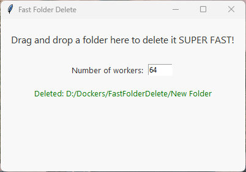

# FastFolderDelete



A super-fast Windows folder deletion tool with a drag-and-drop GUI, leveraging parallel file operations for maximum speed. Ideal for deleting large folders with thousands of files and subfolders.

## Features

- **Drag and drop** folders to delete them instantly
- **Parallel deletion** using multiple worker threads (configurable)
- **Simple GUI** built with Tkinter and tkinterdnd2
- **Test folder generator** for benchmarking

## Requirements

- Python 3.7+
- Windows OS (uses Windows-specific commands and paths)
- [tkinterdnd2](https://pypi.org/project/tkinterdnd2/)

## Installation & Usage

### Easiest: Download the Precompiled Windows Executable

1. Go to the [Releases section](https://github.com/yujingr/FastFolderDeleteForWindows/releases) of this repository.
2. Download the latest `fast_folder_delete_gui.exe` from the latest release.
3. Double-click `fast_folder_delete_gui.exe` to launch the app.
4. Drag and drop a folder onto the window.
5. Confirm deletion when prompted.
6. Optionally, set the number of worker threads for parallel deletion (default: 64).

> **Note:** You do not need Python or any dependencies to use the precompiled executable.

### Advanced: Run from Python Source

1. Clone this repository or download the files.
2. Install dependencies:
   ```bash
   pip install tkinterdnd2
   ```
3. Run the GUI:
   ```bash
   python fast_folder_delete_gui.py
   ```
4. Drag and drop a folder onto the window.
5. Confirm deletion when prompted.
6. Optionally, set the number of worker threads for parallel deletion (default: 64).

### Generate a Large Test Folder

To create a large folder structure for testing:

```bash
python generate_big_folder.py
```

This will create a folder named `test_big_folder` with 1000 subfolders, each containing 30 files.

## Notes

- **Warning:** This tool permanently deletes folders and their contents. Use with caution!
- The deletion process is optimized for NTFS file systems on Windows.
- If you encounter issues with drag-and-drop, ensure `tkinterdnd2` is installed and you are running on Windows.

## License

MIT License
